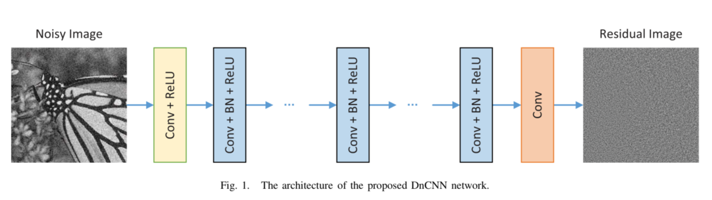
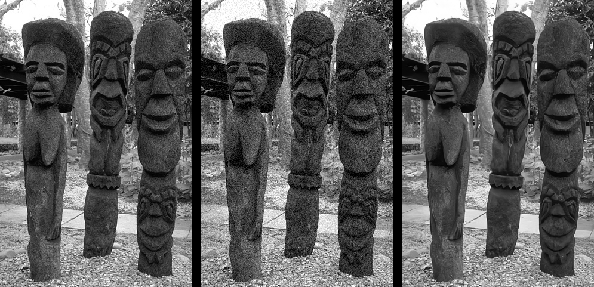

# DnCNN_Paddle
Beyond a Gaussian Denoiser: Residual Learning of Deep CNN for Image Denoising 论文复现

官方源码：[https://github.com/cszn/DnCNN](https://github.com/cszn/DnCNN)

官方Pytorch实现：[https://github.com/SaoYan/DnCNN-PyTorch](https://github.com/SaoYan/DnCNN-PyTorch)

复现地址：[https://github.com/sldyns/DnCNN_paddle](https://github.com/sldyns/DnCNN_paddle)

## 1. 简介



由于深度学习的进步以及卷积神经网络在视觉方向取得的巨大成功，使得更多学者聚焦于此。作者注意到在残差网络之前，预测残差图像的策略已经被用于一些低水平视觉问题，如单幅图像超分辨率和彩色图像去噪。他认为在图像复原领域（尤其是在噪音程度较小的情况下），含噪图像与无噪图像的残差非常小，所以理论上**残差学习**非常适合运用到图像复原上。

而**批量归一化**操作通过一定的规范化手段，把每层神经网络任意神经元这个输入值的分布强行拉回到**均值为0方差为1的标准正态分布**，这减轻了内部协变量的移位，同时使梯度变大，避免了梯度消失的问题，而且梯度变大意味着学习收敛速度快，能大大加快训练速度。

这样的网络设计就是在隐层中将干净图像 x 从含噪图像 y 中消去。在超分领域，低分辨率图片就是高分辨率图片的双三次上采样操作形成的，故超分领域的残差图片和去高斯噪声领域的残差图片是等价的，同理还有JPEG解锁领域的残差图片。因而DnCNN网络同时具有良好的**盲去噪能力.**

## 2. 复现精度

在 BSD68 测试集上做了10次测试，达到验收指标：average PSNR, noise 15: 31.73

| DnCNN-B | Noise Level15       |
| ------- | ------------------- |
| Pytorch | 31.73               |
| Paddle  | 31.73757 (10 times) |

## 3. 数据集和文件结构

官方代码提供的训练数据集地址：https://github.com/SaoYan/DnCNN-PyTorch/tree/master/data/train

测试数据集地址：https://github.com/cszn/FFDNet/tree/master/testsets/BSD68

**注：**所有数据已经存放在 `data/` 文件夹下了，可以无需下载.

**文件结构**

```
DnCNN_Paddle
    |-- data
         |-- BSD68           # 测试所用的BSD68数据集
         |-- train           # 训练所用的数据,包含400张图片
    |-- logs
         |-- net.pdparams    # 训练过程保存的模型参数文件
         |-- vdlrecords.1649579479.log # 完整的训练日志
    |-- test_tipc            # TIPC: Linux GPU/CPU 基础训练推理测试
    |-- dataset.py           # 数据及预处理相关代码
    |-- export_model.py      # 预训练模型的导出代码
    |-- LICENSE              # LICENSE文件
    |-- models.py            # 模型定义代码
    |-- README.md            # README.md文件
    |-- test.py              # 测试文件
    |-- train.py             # 单机单卡训练文件
    |-- train2.py            # 单机多卡训练文件
    |-- utils.py             # 一些工具文件
    |-- val.py               # 测试代码
```

## 4. 环境依赖

PaddlePaddle >= 2.1.2

scikit-image >= 

## 5. 快速开始

### 初次训练（单机单卡）

```shell
python train.py --preprocess True --data_dir data/train --val_dir data/BSD68 --num_of_layers 17 --noiseL 15 --val_noiseL 15
```

参数说明：

- --preprocess True 表示需要作数据预处理
- --data_dir data/train 训练数据路径
- --val_dir data/BSD68 验证数据路径
- --num_of_layers 17 模型层数为17层
- --noiseL 15 训练的噪声水平为15
- --val_noiseL 15 验证的噪声水平为15

初次训练指定 --preprocess True，则会生成 `train.h5` 和 `val.h5` 两个文件，再次训练则不需要指定改参数：

### 重新训练

```shell
python train.py --num_of_layers 17 --noiseL 15 --val_noiseL 15
```

### 单机多卡训练

```shell
python -m paddle.distributed.launch --selected_gpus '0,1' train2.py --num_of_layers 17 --noiseL 15 --val_noiseL 15
```

此处为用两张卡，指定 GPU 为 0 和 1.

### 日志读取

训练过程会将日志记录和模型参数保存在 `logs/` 文件夹下.

日志是用 VisualDL 工具记录的，在根目录下，可通过以下方式查看：

```shell
visualdl --logdir ./logs/
```

或通过：

```python
from visualdl.server import app
app.run(logdir="logs")
```

### 模型验证

在 BSD58 数据集上作了 10 次测试，噪声强度为 15

```shell
python val.py --log_dir logs --test_data BSD68 --test_noiseL 15
```

输出如下：

```
10 times test on test data, Averate PSNR: 31.73757101865349, Variance: 1.6846021796340226e-05
```

显著达到了验收精度.

### 预训练模型导出：

```shell
python export_model.py --num_of_layers 17 --logdir logs --savedir output/
```

### 预测

以 BSD58 数据为例，噪声强度为 15，结果存放在 `results/` 文件夹下

```shell
python infer.py --log_dir logs --data_path data/BSD68/ --save_path results/ --test_noiseL 15
```

其中，`results/couple` 中的图片为 原始图像、带噪图像、去噪结果，3 张图片拼接得到的：



## 6. TIPC

首先安装AutoLog（规范化日志输出工具）

```shell
pip install  https://paddleocr.bj.bcebos.com/libs/auto_log-1.2.0-py3-none-any.whl
```

在linux下，进入 DnCNN_paddle 文件夹，运行命令：

```shell
bash test_tipc/prepare.sh ./test_tipc/configs/ddrnet/train_infer_python.txt 'lite_train_lite_infer'
bash test_tipc/test_train_inference_python.sh ./test_tipc/configs/ddrnet/train_infer_python.txt 'lite_train_lite_infer'
```

## 7. LICENSE

本项目的发布受[Apache 2.0 license](https://github.com/PaddlePaddle/models/blob/release/2.2/community/repo_template/LICENSE)许可认证。
